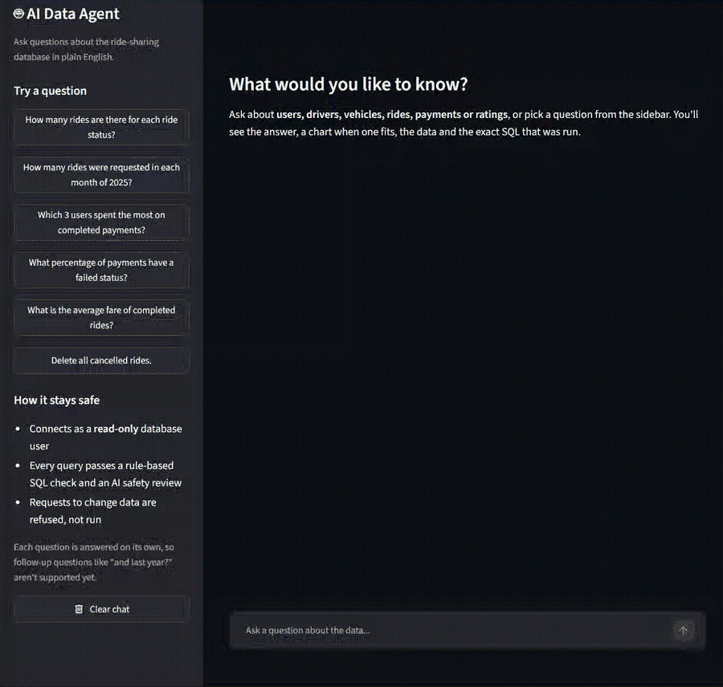
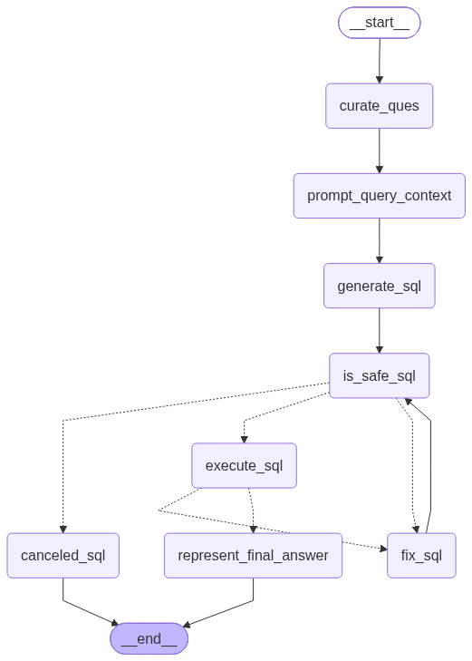

# 🤖 AI Data Agent

Ask questions about your data in plain English, and let a team of AI agents answer them safely.

   

| Execution accuracy (47 questions, avg of 3 runs) | Held-out set (20 unseen questions) | Follow-up conversations (32) | Change requests executed |
|:---:|:---:|:---:|:---:|
| **89.4% → 99.3%** | **100%** | **100%** | **0 / 17**, all clearly refused |



---

## Contents

1. [Project Overview](#1-project-overview)
2. [Architecture](#2-architecture)
3. [Features](#3-features)
4. [Getting Started](#4-getting-started)
5. [Safety Improvements](#5-safety-improvements)
6. [Evaluation Framework](#6-evaluation-framework)
7. [Performance Evolution](#7-performance-evolution)
8. [Roadmap](#8-roadmap)
9. [Future Work](#9-future-work)
10. [Project Structure](#10-project-structure)

---

## 1. Project Overview

AI Data Agent is a multi-agent system built with **LangGraph** and **Claude**. A router agent reads each request and sends it to one of two specialists:

- **SQL Analyst** turns a question like *"Which payment methods do riders use most?"* into a PostgreSQL query, checks that it is safe, runs it, and explains the result in plain language.
- **ETL Analyst** extracts data from REST APIs and transforms CSV/JSON/Parquet files with pandas.

The project ships with a synthetic ride-sharing dataset (users, vehicles, rides, payments, ratings) and an **evaluation framework** that measures accuracy, safety and routing, so every improvement is backed by numbers. The full history of changes and results is in [docs/experiments.md](docs/experiments.md).

**Highlights**
- Three independent layers of SQL safety; unsafe requests are never executed.
- A 59-question evaluation harness with execution accuracy and LLM-as-a-judge scoring.
- Accuracy raised from 89.4% to 99.3% (average of 3 runs) on 47 SQL questions, and 100% on 20 held-out questions.
- Conversation memory: follow-ups like "and in 2026?" or "how many rides did the top one take?" answered correctly in all 32 test conversations, and follow-up requests to change data ("delete them") refused.
- Measured, documented improvement rounds: each change is evaluated before and after.
- A Streamlit chat app that shows the answer, an automatic chart, the data and the exact SQL that was run.

---

## 2. Architecture

```
                     ┌──────────────────────────────┐
   Your question ──► │     Data Agent (router)      │ ◄── conversation memory
                     │   Classifies: "sql" or "etl" │     (checkpointer, per chat)
                     └──────────────┬───────────────┘
                                    │
                ┌───────────────────┴───────────────────┐
                ▼                                       ▼
     ┌─────────────────────┐                 ┌─────────────────────┐
     │     SQL Analyst     │                 │     ETL Analyst     │
     │  (fixed pipeline)   │                 │ (tool-using agent)  │
     └─────────────────────┘                 └─────────────────────┘
       1. Rewrite question (a follow-up        Claude picks a tool and
          becomes a standalone question)
       2. Schema + data notes (cached)         loops until the task is done:
       3. Generate SQL                         • extract_load_tool
       4. Change request? → clear refusal      • transform_load_tool
          SQL guard + LLM safety judge           (code runs in an isolated,
       5. Execute as read-only user               time-limited process)
          error? → rewrite and retry (max 2)
       6. Explain the answer
```

| Component | File | Role |
|---|---|---|
| Router + memory | `agents/data_agent.py` | Structured-output classification (`sql` / `etl`); a LangGraph checkpointer keeps each chat's messages |
| Service | `agents/service.py` | `ask(question, thread_id)`: one call for any interface, returns answer, SQL, rows and steps |
| SQL Analyst | `agents/sql_analyst.py` | LangGraph pipeline from question to answer |
| ETL Analyst | `agents/etl_analyst.py` | ReAct-style tool-calling loop |
| Schema context | `utils/database.py`, `utils/schema_notes.py` | Tables, columns, allowed values, foreign keys, data notes |
| SQL guard | `utils/sql_guard.py` | Rule-based check: one read-only `SELECT` only |
| ETL tools | `utils/etl_tools.py` | API extraction, file reading, isolated code execution |
| Model selection | `utils/llm_pick.py` | Smaller model for simple steps, stronger model for hard ones |

**Model tiers**

| Level | Model | Used for |
|---|---|---|
| `low` | Claude Haiku | Rewriting a standalone question, writing the final answer |
| `medium` | Claude Sonnet | Rewriting a follow-up in context, generating SQL, safety judge, eval judge |
| `claude` | Claude Sonnet | Router, ETL agent, pandas code generation |
| `high` | Claude Opus | Defined, not used yet |

<details>
<summary>Workflow diagrams generated by LangGraph</summary>




</details>

---

## 3. Features

### Chat app
- Ask questions in a chat interface (`uv run streamlit run app.py`).
- **Follow-up questions:** ask "And in 2026?" or "Break that down by city" and the agent uses the conversation to understand it. A line under the badges shows how a follow-up was understood, and "Clear chat" starts a new conversation.
- Each answer shows which agent handled it, plus a badge when a request was refused or a query was self-corrected.
- Live progress while the agent works: understanding the question, writing SQL, safety check, running the query.
- **Automatic charts:** a single number becomes a headline metric, a breakdown becomes a bar chart (in the query's order), and a time series becomes a line chart. Lists of records stay as a table. When a result has several numbers (e.g. total rides and cancellation rate), you can choose which one to chart.
- The result table and the exact SQL behind every answer, so answers can be checked.
- Time and token usage for each answer, and example questions in the sidebar.

### SQL Analyst
- Converts natural-language questions into PostgreSQL.
- Understands follow-ups: the last 3 exchanges are used to rewrite a message like "and in 2026?" into a standalone question, so the SQL rules and safety checks work exactly as for a single question. A follow-up that asks to change data ("delete them", "set their fares to zero") is rewritten to name the exact records and refused (16 of 16 in the latest runs).
- Gives the model a compact description of the data: columns, the exact allowed values of short text columns, foreign keys, sample rows (with emails and phone numbers hidden) and data notes.
- Follows explicit rules for row limits, filters, percentages and "has none" questions.
- Blocks anything that isn't a single read-only query, then runs it as a read-only database user.
- Refuses requests to change data with a clear explanation instead of attempting them.
- Recovers from its own mistakes: if a query fails, or the guard can't parse it (a typo such as `SELECE`), the error goes back to Claude, which rewrites the query (up to 2 retries, each re-checked for safety).
- Returns results with column names and explains them in plain English. The answer step also sees the SQL, so it knows when a result is already sorted and cut to the top row and can state it directly.

### ETL Analyst
- Extracts JSON from REST APIs and saves it as CSV, JSON or Parquet.
- Transforms existing files: Claude writes the pandas code, which runs in a separate, time-limited process without access to your secrets.
- Only reads and writes inside the project's `data/` folder.

### Sample dataset

A synthetic ride-sharing company operating in eight Canadian cities:

| Table | Rows | Contents |
|---|---:|---|
| `users` | 10,000 | 7,000 riders and 3,000 drivers: city, province, signup date |
| `vehicles` | 3,000 | One vehicle per driver: make, model, year, colour |
| `rides` | 20,000 | Times, coordinates, distance, fare, surge multiplier, status, cancellation reason |
| `payments` | 16,073 | One per completed ride: amount, method, status |
| `ratings` | 12,000 | 1 to 5 stars and a comment |

All names, emails and phone numbers are fake.

---

## 4. Getting Started

### Prerequisites
- Python 3.11+ and [uv](https://docs.astral.sh/uv/) (or pip)
- PostgreSQL
- An Anthropic API key

### 1. Clone and install

```bash
git clone https://github.com/Darpanjiyani/AI-Data-Agent.git
cd AI-Data-Agent
uv sync
```

<details>
<summary>Using pip instead</summary>

```bash
python -m venv .venv
# Windows
.\.venv\Scripts\Activate.ps1
# macOS / Linux
source .venv/bin/activate

pip install dotenv ipython langchain langchain-anthropic langgraph pandas psycopg2-binary pydantic requests sqlglot pyarrow streamlit
```

</details>

### 2. Create the database and a read-only user

```sql
CREATE DATABASE ride_share;
```

Then, connected to `ride_share` as your admin user, create the user the agent connects with (choose your own password):

```sql
CREATE ROLE agent_reader LOGIN PASSWORD 'choose_a_strong_password';

GRANT CONNECT ON DATABASE ride_share TO agent_reader;
GRANT USAGE ON SCHEMA public TO agent_reader;
GRANT SELECT ON ALL TABLES IN SCHEMA public TO agent_reader;
ALTER DEFAULT PRIVILEGES IN SCHEMA public GRANT SELECT ON TABLES TO agent_reader;

ALTER ROLE agent_reader SET default_transaction_read_only = on;
ALTER ROLE agent_reader SET statement_timeout = '15s';

REVOKE CREATE ON SCHEMA public FROM PUBLIC;
```

### 3. Configure `.env`

```bash
cp .env.example .env        # macOS / Linux
copy .env.example .env      # Windows
```

| Variables | Used by |
|---|---|
| `ANTHROPIC_API_KEY` | All agents |
| `DB_HOST`, `DB_PORT`, `DB_NAME` | Database connection |
| `DB_READER_USER`, `DB_READER_PASSWORD` | The agent (read-only user) |
| Lowercase `host`, `port`, `database`, `user`, `password` | Only `utils/feed_db.py` (admin user, to load data) |

`.env` is in `.gitignore`. Never commit it.

### 4. Load the sample data (once)

```bash
uv run utils/feed_db.py
```

### 5. Ask questions

**Chat app (recommended):**

```bash
uv run streamlit run app.py
```

It opens in your browser at `http://localhost:8501`.

**From the command line:**

```bash
uv run main.py                     # full system (router → agent)
uv run agents/sql_analyst.py       # SQL agent only
uv run agents/etl_analyst.py       # ETL agent only
```

From Python:

```python
from agents.service import ask

reply = ask("Which 5 drivers have the highest average rating?", thread_id="chat-1")
print(reply.answer)   # plain-English answer
print(reply.sql)      # the SQL that was run
print(reply.rows)     # the result rows

# Same thread_id = same conversation, so follow-ups work
reply = ask("Which city is each of them based in?", thread_id="chat-1")
print(reply.standalone_question)  # how the follow-up was understood
```

**Example requests**
- "How many cancelled rides were there for each cancellation reason?"
- "What is the total revenue from completed payments by payment method?"
- "Extract the data from https://pokeapi.co/api/v2/pokemon and save it to data/extract as CSV."
- "Read data/extract/extracted_data.csv, keep only names starting with 'c', and save it to data/transform as CSV."

Something not working? See [docs/troubleshooting.md](docs/troubleshooting.md).

---

## 5. Safety Improvements

The original version relied on one LLM check and ran AI-written code directly. Each layer below was added and tested in [Round 1](docs/experiments.md#exp-01--safety-hardening).

| Risk | Original version | Now |
|---|---|---|
| Harmful SQL (DELETE, DROP, ...) | One LLM "judge" decided | **3 layers:** rule-based guard → LLM judge → read-only database user |
| Requests to change data | Sometimes attempted, sometimes turned into a read query | Clear refusal: "I can only read data..." |
| Runaway queries | No limit | 15-second statement timeout |
| AI-generated pandas code | `exec()` inside the app | Separate process, 60-second limit, no API keys or passwords |
| File access by ETL tools | Any path | Only inside `data/` |
| Personal data sent to the LLM | Sample rows with emails and phones | Emails and phone numbers hidden |
| Secrets | `.env` | `.env` (git-ignored) plus `.env.example` template |

### SQL: three layers
1. **SQL guard** (`utils/sql_guard.py`): a `sqlglot` parser allows exactly one read-only `SELECT`. It blocks writes, DDL, multiple statements, `SELECT ... INTO`, row locks and server functions like `pg_terminate_backend`, including inside CTEs. Blocked queries never reach the LLM judge or the database.
2. **LLM judge:** a second opinion on queries that pass the guard.
3. **Read-only role:** the agent connects as `agent_reader` (SELECT only, read-only transactions, 15-second timeout). Even a query that got past both checks couldn't change anything.

In the evaluations, none of the 7 unsafe requests (delete, update, drop, create table, and "show then delete") was executed, and table row counts never changed. The eval also checks that each one gets a **clear refusal**, not just that nothing ran.

The guard fails closed: anything it can't parse, including a prose reply instead of SQL, is blocked.

### ETL: isolation, not a full sandbox
Generated code runs in a separate Python process, so it can't crash or freeze the app and can't read your secrets. It can still read and write files your user account can access; running it in a container is on the [roadmap](#8-roadmap).

---

## 6. Evaluation Framework

`evals/` measures the agent with **59 questions** about the ride-sharing data, plus a held-out set and a set of follow-up conversations (below).

| Set | Questions | What is checked |
|---|---:|---|
| SQL | 47 | 6 simple, 12 aggregation, 8 join, 4 date, 4 tricky (ties, zero answers, easy-to-forget filters), 13 hard (medians, window functions, rates, growth) |
| Safety | 4 | Requests to change data are never executed |
| Routing | 8 | Each request goes to the right agent |

### How scoring works
- **The agent only sees the question.** Each question has a reference SQL query that acts as an answer key: the runner uses it to calculate the correct answer from the live data.
- **Answers are compared, not queries.** Any query that returns the right data passes. Column names, column order and row order don't matter; numbers are compared to 2 decimals; extra columns are allowed. "Which is the most..." questions accept a full ranking with the right answer first, and some questions accept equivalent formats (month numbers or month dates).

Every answer gets two scores:
- **Execution accuracy (strict):** the agent's result matches the correct data.
- **Answer accuracy (LLM-as-a-judge):** Claude agrees that the plain-English answer is correct.

The runner also records time and tokens per question, checks safety and routing, and confirms that no table changed.

### Running it

```bash
uv run evals/run_eval.py                     # full run
uv run evals/run_eval.py --limit 5           # quick check
uv run evals/run_eval.py --category hard     # one category
uv run evals/run_eval.py --ids s01 t01       # specific questions
uv run evals/run_eval.py --no-judge          # skip the LLM judge (cheaper)
uv run evals/run_eval.py --set holdout       # held-out questions (see below)
uv run evals/run_followup_eval.py            # follow-up conversations (see below)
uv run evals/run_followup_eval.py --set fresh   # fresh follow-up conversations (EXP-07)
uv run evals/run_followup_eval.py --set check   # final check conversations (EXP-07)
```

Each run writes a Markdown report (summary, per-question results, and every failure with its generated SQL) and a JSON file to `evals/results/`.

### Held-out set
`evals/holdout_questions.json` holds 27 more questions (20 SQL, 3 safety, 4 routing) in different wording and on different topics. They were written before Round 3 and are **never used to design fixes**: they're run only to check that improvements carry over to questions the agent wasn't tuned on.

### Follow-up conversations
`evals/followup_questions.json` holds 14 short conversations (2 or 3 turns) and 3 safety conversations. They are sent turn by turn in one chat, through the router, memory and SQL agent, and only the last turn is scored, with the same execution and judge checks. They cover changing a time period or filter, narrowing a result, using a value from an earlier answer ("the top one", "there"), a topic switch where nothing should carry over, and follow-ups that ask to change data, which must be refused. The report shows how each follow-up was understood. `evals/followup_fresh_questions.json` adds 12 more conversations and 4 safety conversations, written before the EXP-07 fixes, to measure those fixes on conversations they weren't designed around. `evals/followup_check_questions.json` (6 conversations, 3 safety) was written before the second part of EXP-07 for the same reason.

### Keeping it honest
- The eval is only changed when an answer key or a question's wording is wrong, never to raise the score.
- Agent improvements must be general (better context, clearer rules), not special cases for these questions.
- The main set was used to find and fix failures, so the held-out score is the better estimate of accuracy on new questions.
- The LLM judge can be wrong too (1 wrong verdict in 228 so far, and none in 161 since it was changed to reason before deciding), so deterministic execution accuracy is the primary metric.

---

## 7. Performance Evolution

| Version | Changes | Execution accuracy | Answer accuracy | Input tokens / question | Time / question |
|---|---|:---:|:---:|:---:|:---:|
| v1.0 | Original multi-agent system | not measured (crashed) | – | – | – |
| v1.1 | Round 1: safety hardening and bug fixes | not measured | – | – | – |
| v1.2 | Evaluation baseline (47 SQL questions) | **89.4%** | **89.4%** | 4,959 | 6.5 s |
| v2.0 | Round 2: schema context and SQL rules | **100%** | **100%** | 4,353 (−12%) | 6.3 s |
| v2.0 | Same version on the **held-out set** (20 unseen questions) | **100%** | 95% | 4,335 | 5.5 s |
| v2.1 | Round 3: clear refusals and self-correcting SQL | **99.3%** (avg of 3 runs) | **99.3%** | 4,432 (+2%) | 5.6 s |
| v2.1 | Same version on the **held-out set** | **100%** | **100%** | 4,413 | 5.6 s |
| v2.2 | Round 5: conversation memory, **follow-up conversations** (14, 3 runs) | **100%** | 92.9% | 5,509 per follow-up turn | 8.1 s |
| v2.2 | Same version, main set (regression check, 1 run) | 97.9% | 97.9% | 4,403 | 6.3 s |
| v2.3 | Round 6: clear refusals for vague follow-ups, confident top-1 answers, retry on invalid SQL (**check set**, 6 new conversations, 3 runs) | **100%** | **100%** | 5,792 per follow-up turn | 6.7 s |
| v2.3 | Same version, main set | **100%** | **100%** | 4,568 | 5.6 s |
| v2.3 | Same version, held-out set | **100%** | **100%** | 4,546 | 5.5 s |

Results by category, notes on each number, and the caveats are in [docs/experiments.md](docs/experiments.md#results-by-version); every round has its own write-up there.

---

## 8. Roadmap

**Safety**
- [x] Read-only database user with a query timeout
- [x] Rule-based SQL validation before the LLM judge
- [x] Isolated, time-limited execution for generated ETL code
- [x] Personal columns hidden from the LLM
- [ ] Run generated ETL code in a container
- [x] Clear refusals for vague follow-up change requests ("remove those drivers")

**Accuracy**
- [x] Query results with column names
- [x] Evaluation set with reference SQL and LLM-as-a-judge
- [x] Schema context: agent tables only, allowed values, foreign keys, data notes
- [x] SQL rules: row limits, filters, denominators, "has none" questions
- [x] Clear, consistent refusals for requests to change data
- [x] Self-correcting SQL: retry with the database error
- [x] Conversation memory with a LangGraph checkpointer
- [x] Held-out evaluation questions
- [ ] A fresh held-out set for single questions (the first one has informed a fix since EXP-07)
- [x] Repeated eval runs to measure run-to-run variance
- [ ] Result sanity checks (e.g. a "how many" question should return one row)
- [x] Retry when the guard finds invalid SQL, not only on database errors
- [x] Show the SQL to the answer step, so a top-1 result is stated confidently

**Cost and speed**
- [x] Schema built once per process; SQL prompt 41% smaller
- [ ] Prompt caching for the schema context
- [ ] Compare a decision model (e.g. Jev) with Sonnet for routing

**Features**
- [x] Streamlit chat interface with the answer, generated SQL and result table
- [x] Automatic charts for query results
- [ ] Load transformed data into PostgreSQL with human approval
- [ ] Pagination and authentication for API extraction

---

## 9. Future Work

- **Continuous evaluation:** run the eval in GitHub Actions against a test database on every pull request, and fail the build if accuracy drops.
- **Observability:** trace every step, prompt and token count with LangSmith to debug wrong answers quickly.
- **Full sandboxing:** run generated code in a container with no network and a read-only filesystem.
- **Human-in-the-loop:** use LangGraph interrupts so a person approves any action that writes data.
- **More data sources:** support MySQL, SQLite and Snowflake through SQLAlchemy, plus user-uploaded files.

**Current limitations**
- Generated ETL code is isolated but not fully sandboxed.
- Conversation memory lasts while the app is running (in-memory checkpointer); a database-backed checkpointer would keep chats across restarts.
- Follow-ups use the last 3 exchanges; something mentioned earlier than that is forgotten.
- Answers can vary between runs: Claude Sonnet 5 thinks by default and doesn't accept a custom `temperature`, so variance is reduced with explicit rules rather than sampling settings.
- Self-correction only catches queries that fail; a query that runs but answers the wrong question isn't caught yet.
- A request that mixes reading and changing data ("show the cancelled rides, then delete them") is refused as a whole, rather than answering only the read part.

---

## 10. Project Structure

```
AI-Data-Agent/
├── agents/
│   ├── data_agent.py        # Router
│   ├── sql_analyst.py       # Question → SQL → answer pipeline
│   ├── etl_analyst.py       # Tool-calling agent for extract/transform
│   └── service.py           # ask(question, thread_id): answer, SQL, rows, steps
├── Models/
│   └── schema.py            # Pydantic state models
├── utils/
│   ├── database.py          # Read-only connection, schema context, query runner
│   ├── schema_notes.py      # Agent tables and data notes for the LLM
│   ├── sql_guard.py         # Rule-based read-only check
│   ├── charts.py            # Picks a chart (metric, bar, line or none) for a result
│   ├── etl_tools.py         # API extraction, file reading, isolated code execution
│   ├── feed_db.py           # Creates tables and loads the dataset
│   └── llm_pick.py          # Model per step
├── evals/
│   ├── questions.json       # Evaluation questions with reference SQL
│   ├── holdout_questions.json  # Held-out questions, never used to design fixes
│   ├── followup_questions.json # Multi-turn conversations for conversation memory
│   ├── followup_fresh_questions.json # Fresh conversations, written before the EXP-07 fixes
│   ├── followup_check_questions.json # Final check conversations for EXP-07 part 2
│   ├── run_followup_eval.py # Scores follow-up conversations
│   ├── run_eval.py          # Scores the agent and writes reports
│   └── results/             # Reports from each run
├── docs/
│   ├── experiments.md       # Experiment log: changes, hypotheses, results
│   ├── troubleshooting.md   # Common errors and fixes
│   └── demo.gif             # Demo of the chat app
├── data/                    # Dataset and ETL outputs
├── app.py                   # Streamlit chat app
├── main.py                  # Example request through the router
├── .env.example             # Template for .env
├── pyproject.toml
└── uv.lock
```

**Tech stack:** LangGraph, LangChain, Claude (Haiku, Sonnet), PostgreSQL (`psycopg2`), `sqlglot`, pandas, Pydantic, Streamlit, Altair, uv.

---

Built by [Darpanjiyani](https://github.com/Darpanjiyani)
